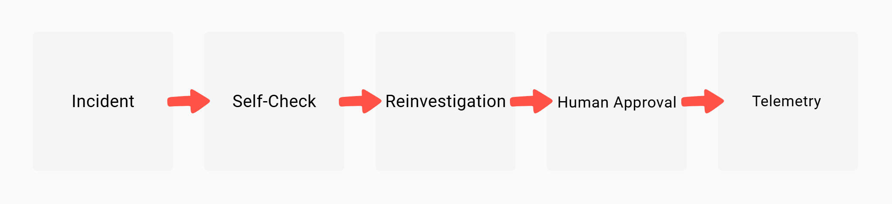
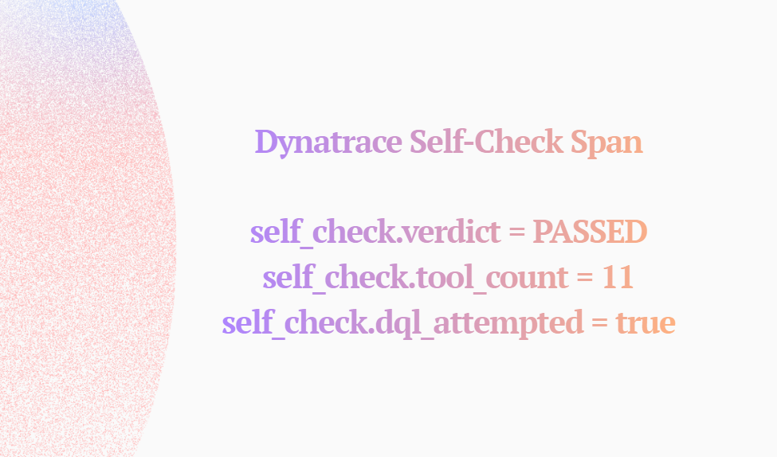

# ReliabilityAgent

> **Google Cloud Rapid Agent Hackathon 2026**

**An AI SRE that reads its own Dynatrace trace to decide whether it investigated well enough — then reinvestigates if it didn't.**

Gemini queries live telemetry, executes runbooks, and synthesizes root cause. When it finishes, it reads back its own trace waterfall from Dynatrace Grail to verify it called at least 3 distinct tools. If the self-check fails, the agent injects a corrective prompt and runs again. Every phase of this loop — including the loop itself — is a live OTel span in Grail, queryable by DQL.

Observability stops being a read-only audit trail. It becomes part of the control plane.

[](https://python.org)
[](https://ai.google.dev)
[](https://google.github.io/adk-docs/)
[](https://opentelemetry.io)
[](https://www.dynatrace.com)
[](https://fastapi.tiangolo.com)

---

## What Makes This Different

| | |
|---|---|
| **Recursive self-observability** | After investigation, the agent queries its own Dynatrace trace to verify it called ≥ 3 distinct tools. Insufficient coverage triggers a full reinvestigation — automatically. |
| **Dynatrace as a cognitive feedback signal** | The agent doesn't just *emit* telemetry — it *reads from it* to govern its next action. |
| **Zero mock data, zero fake verdicts** | `self_check.verdict` is driven by actual recorded tool calls in an in-process registry, not a counter or modulo. |
| **Human-in-the-loop autopsy** | `/autopsy/start` → evidence gathering → structured hypothesis with confidence score → operator approves or redirects → Gemini writes the postmortem. Auditable state machine. |
| **Full OTel signal triad** | `TracerProvider` + `MeterProvider` + `LoggerProvider` wired to Dynatrace via OTLP HTTP. Structured logs carry `trace_id` correlation. Token cost computed per-model, recorded as a span attribute and OTel metric. |
| **Importable Dynatrace dashboard** | 7 DQL tiles — verdict distribution, reinvestigation rate, cost over time, phase durations, recent incidents. Ships as `config/dynatrace_dashboards.json`. |
| **Docker + Cloud Run ready** | `Dockerfile` and `deploy/gcloud/deploy.sh` included. One command deploys to GCP with correct memory, CPU, and timeout. |

---

## Architecture

```
┌─────────────────────────────────────────────────────────────────────┐
│  INGRESS  (FastAPI — main.py)                                       │
│                                                                     │
│  POST /handle-incident   custom alert webhook                       │
│  POST /demo/incident     pre-canned P1 — no body required           │
│  POST /autopsy/start     stateful RCA with human review             │
│  GET  /autopsy/{id}/status                                          │
│  POST /autopsy/{id}/feedback   approve | redirect                   │
│  GET  /ui                dark-theme SPA (static/index.html)         │
│  GET  /health            liveness probe                             │
└────────────────────────────┬────────────────────────────────────────┘
                             │ FastAPI BackgroundTask (non-blocking)
                             ▼
┌─────────────────────────────────────────────────────────────────────┐
│  AGENT LAYER  (agent/core.py)                                       │
│                                                                     │
│  ReliabilityAgent                                                   │
│    ├── Google ADK Runner + InMemorySessionService                   │
│    ├── Gemini (gemini-3.1-flash-lite, configurable via GEMINI_MODEL)│
│    ├── TRIAGE_PROMPT + INCIDENT_PROMPT_TEMPLATE                     │
│    └── Retry loop: max_retries = 1 (one reinvestigation per run)    │ 
│                                                                     │
│  TOOLS  (all wrapped as google.adk.tools.FunctionTool)              │
│                                                                     │
│  ┌────────────────────────────────────────────────────────────┐     │
│  │ query_dynatrace_traces                                     │     │
│  │   GET /api/v2/traces on DYNATRACE_TENANT_URL               │     │
│  │   Failure → {"success": false, "error": "<real msg>"}      │     │
│  │                                                            │     │
│  │ query_gcp_logs                                             │     │
│  │   GCP Cloud Logging SDK  list_log_entries                  │     │
│  │   Failure → {"success": false, "error": "<real msg>"}      │     │
│  │                                                            │     │
│  │ execute_runbook                                            │     │
│  │   Emits agent.tool.runbook.execute OTel span               │     │
│  │   Records tool call in registry                            │     │
│  │                                                            │     │
│  │ verify_investigation_thoroughness_tool                     │     │
│  │   Reads _tool_registry[trace_id] → real call count         │     │
│  │   verdict = PASSED if count ≥ 3 else FAILED                │     │
│  │   Bonus: attempts Grail DQL (graceful 401 fallback)        │     │
│  └────────────────────────────────────────────────────────────┘     │
│                                                                     │
│  _tool_registry.py                                                  │
│    defaultdict(list): trace_id → [tool_name, ...]                   │
│    Written on every tool call · Read by self-check                  │
└────────────────────────────┬────────────────────────────────────────┘
                             │ OTLP HTTP (protobuf)
                             │ BatchSpanProcessor · OTLPSpanExporter
                             ▼
┌─────────────────────────────────────────────────────────────────────┐
│  OBSERVABILITY  (observability/)                                    │
│                                                                     │
│  TracerProvider  → OTLPSpanExporter   → /api/v2/otlp/v1/traces      │
│  MeterProvider   → OTLPMetricExporter → /api/v2/otlp/v1/metrics     │
│  LoggerProvider  → OTLPLogExporter    → /api/v2/otlp/v1/logs        │
│                                                                     │
│  Metrics emitted:                                                   │
│    agent.tokens.total      (counter, labelled by model)             │
│    agent.incident.cost_usd (histogram, labelled by incident.id)     │
└────────────────────────────┬────────────────────────────────────────┘
                             │
                             ▼
┌─────────────────────────────────────────────────────────────────────┐
│  DYNATRACE GRAIL                                                    │
│                                                                     │
│  Distributed Trace Waterfall  ← agent.incident.handle root span     │
│  Span Attribute Search        ← self_check.verdict, llm.cost.usd    │
│  DQL Dashboard (7 tiles)      ← config/dynatrace_dashboards.json    │
│  Grail DQL self-check         ← agent reads its own spans           │
└─────────────────────────────────────────────────────────────────────┘
```

**Every incident produces this span waterfall:**

```
agent.incident.handle                      ← root (cost, tokens, status)
  └─ agent.phase.investigate               ← attempt 1
       ├─ agent.tool.dynatrace.query_traces
       ├─ agent.tool.gcp.query_logs
       ├─ agent.tool.runbook.execute
       └─ agent.phase.self_check           ← verdict: FAILED → retry
  └─ agent.phase.reinvestigate             ← attempt 2
       ├─ agent.tool.dynatrace.query_traces
       ├─ agent.tool.gcp.query_logs
       ├─ agent.tool.runbook.execute
       └─ agent.phase.self_check           ← verdict: PASSED → close
```

---

## Quick Start

```bash
git clone https://github.com/RobertSamuel-tech/ReliabilityAgent.git
cd ReliabilityAgent
python -m venv .venv

# Linux/macOS
source .venv/bin/activate
# Windows
.venv\Scripts\activate

pip install -r requirements.txt
cp .env.example .env          # fill in credentials (see table below)
uvicorn main:app --host 0.0.0.0 --port 8000
```

```bash
curl -X POST http://localhost:8000/demo/incident
# Dynatrace → Distributed Traces → filter service.name = "reliability-agent"
```

Open the UI: **http://localhost:8000/ui**

### Environment Variables

| Variable | Required | Description |
|---|---|---|
| `GOOGLE_API_KEY` | Yes | Gemini API key |
| `DYNATRACE_TENANT_URL` | Yes | e.g. `https://abc12345.live.dynatrace.com` |
| `DYNATRACE_API_TOKEN` | Yes | Scopes: `openTelemetryTrace.ingest`, `metrics.ingest`, `logs.ingest` |
| `GCP_PROJECT_ID` | No | GCP project for Cloud Logging queries |
| `GEMINI_MODEL` | No | Defaults to `gemini-3.1-flash-lite` |

---

## Self-Check Logic

Every tool call writes to an in-process registry keyed by `trace_id`. The self-check reads that registry — not a counter, not a mock:

```python
# _tool_registry.py
_registry: dict[str, list[str]] = defaultdict(list)
def record_tool_call(trace_id, tool_name): _registry[trace_id].append(tool_name)

# self_check.py
_MIN_TOOL_CALLS = 3
tool_count = get_tool_count(trace_id)          # reads actual recorded calls
verdict = "PASSED" if tool_count >= _MIN_TOOL_CALLS else "FAILED"
```

On `FAILED`, `agent/core.py` emits `agent.phase.reinvestigate` and injects:
> *"PREVIOUS INVESTIGATION FAILED SELF-CHECK — re-investigate using different tools."*

---

## Observability Contract

**`agent.incident.handle`** (root span)

`incident.id` · `incident.severity` · `llm.model` · `llm.tokens.input` · `llm.tokens.output` · `llm.cost.usd` · `incident.attempts` · `incident.status`

**`agent.phase.self_check`**

`self_check.verdict` (`PASSED`/`FAILED`) · `self_check.tool_count` · `self_check.threshold` · `self_check.retry_triggered` · `self_check.backend` · `self_check.dql_attempted` · `self_check.dql_backend_result`

---

## Dashboard

Import `config/dynatrace_dashboards.json` (Dashboards → Upload). Seed data:

```bash
curl -X POST http://localhost:8000/demo/incident   # run 2–3 times
```

| Tile | DQL source |
|---|---|
| Total Incidents Handled | `agent.incident.handle` span count |
| Self-Check Verdicts | `self_check.verdict` pass/fail breakdown |
| Self-Check Reinvestigation Rate | `self_check.retry_triggered` |
| Investigation Verdicts | `self_check.verdict` distribution |
| LLM Token Cost Over Time | `llm.cost.usd` sum by 5 min |
| Agent Investigation Phase Durations | avg `duration` by `agent.phase.*` |
| Recent Incidents & Self-Check Status | latest 20 root spans with cost + tokens |

---

## Demo UI

`GET /ui` serves a dark-theme SPA with three panels:

| Panel | Actions |
|---|---|
| **Start Form** | Incident ID, service, time range, description → Start Autopsy |
| **Status & Hypothesis** | Confidence badge, evidence bullets → Approve or Redirect |
| **Postmortem Report** | Gemini-generated structured postmortem, downloadable |

---

## Project Structure

```
ReliabilityAgent/
├── agent/
│   ├── core.py                    # ReliabilityAgent, ADK runner, retry loop, root OTel span
│   ├── prompts.py                 # TRIAGE_PROMPT, INCIDENT_PROMPT_TEMPLATE
│   ├── models/
│   │   └── schemas.py             # IncidentInput, HumanFeedback, Hypothesis, AutopsyState
│   └── tools/
│       ├── _tool_registry.py      # defaultdict(list): trace_id → [tool_names]
│       ├── dt_query.py            # Dynatrace API v2 — real call, honest errors
│       ├── gcp_logs.py            # GCP Cloud Logging SDK — real call, honest errors
│       ├── runbook.py             # Runbook execution with OTel span
│       └── self_check.py          # Registry-based verdict + Grail DQL bonus attempt
├── observability/
│   ├── setup.py                   # TracerProvider, MeterProvider, LoggerProvider, exporters
│   ├── instrumentation.py         # Custom span/metric helpers
│   └── logger.py                  # Structured logger with trace_id correlation
├── static/
│   └── index.html                 # Dark-theme SPA: Start → Hypothesis → Postmortem
├── tests/
│   ├── test_integration.py
│   ├── test_self_check.py
│   ├── test_adk_runner.py
│   ├── test_recursive_incident.py
│   ├── test_collector.py
│   └── test_telemetry.py
├── config/
│   ├── otel-collector-config.yaml # OTel Collector with cost transform processor
│   └── dynatrace_dashboards.json  # Importable dashboard — 7 DQL tiles
├── deploy/
│   └── gcloud/
│       └── deploy.sh              # Cloud Run deploy — one command
├── Dockerfile                     # python:3.11-slim, OTLP env vars, port 8080
├── main.py                        # FastAPI: all endpoints, autopsy state machine
├── requirements.txt
└── .env.example
```

---

## How It Works — End to End

```
Incident
    │
    ▼
Investigation
(query_dynatrace_traces · query_gcp_logs · execute_runbook)
    │
    ▼
Self-Check
(reads own tool-call registry → verdict: PASSED / FAILED)
    │
    ├── PASSED ──────────────────────────┐
    │                                    │
    └── FAILED → Reinvestigation         │
                (corrective prompt +     │
                 new tool calls)         │
                      │                  │
                      └────────────────► ▼
                              Human Approval
                          (/autopsy/{id}/feedback)
                                   │
                                   ▼
                             Postmortem
                      (Gemini-generated, structured)
                                   │
                                   ▼
                      Dynatrace Grail Telemetry
              (every span queryable via DQL in real time)
```

Every trace query, log query, LLM call, self-check verdict, and reinvestigation is recorded as an OpenTelemetry span in Dynatrace Grail — not after the fact, but live, as the agent reasons.

---





---

**Incident → Investigation → Self-Check → Reinvestigation → Human Approval → Telemetry**

ReliabilityAgent is a self-observing AI SRE that investigates incidents, audits its own reasoning, triggers reinvestigations when confidence is low, requires human approval before action, and records every decision as live Dynatrace telemetry.

---

## License

This project is licensed under the MIT License. See the [LICENSE](LICENSE) file for details.

---

## Built For

**Google Cloud Rapid Agent Hackathon 2026 — Dynatrace Track**

